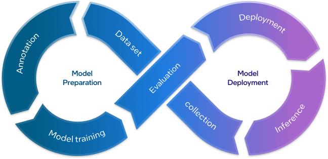
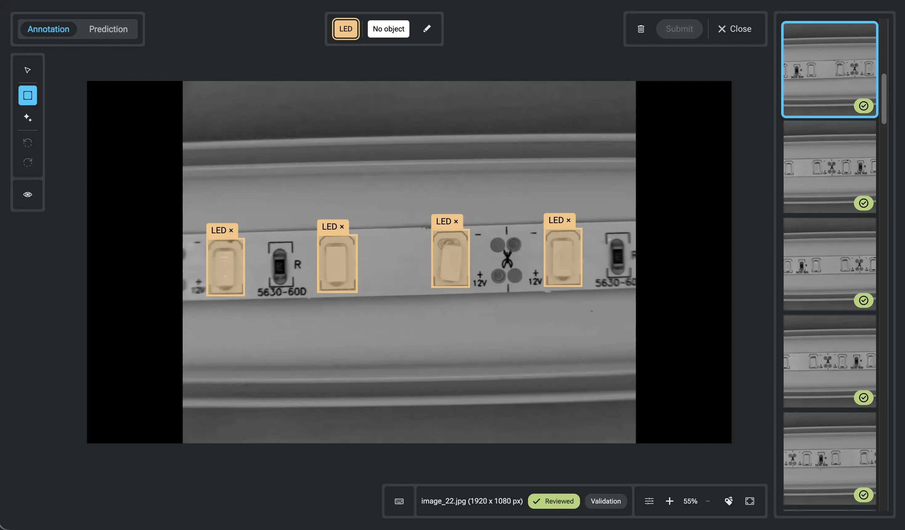

<!-- markdownlint-disable MD013 MD033 MD041 MD042 -->
<div align="center">


[Quick Start](#quick-start) •
[Geti™ documentation](https://docs.geti.intel.com/) •
[`getitune` documentation](library/README.md)

[](https://github.com/open-edge-platform/geti/actions/workflows/build.yaml)
[](https://codecov.io/gh/open-edge-platform/geti)
[](https://securityscorecards.dev/viewer/?uri=github.com/open-edge-platform/geti)
[](https://opensource.org/licenses/Apache-2.0)
[](https://pypi.org/project/getitune/)
[](https://clickpy.clickhouse.com/dashboard/getitune)

</div>

Geti™ is an end-to-end Vision AI application that takes you from raw images to a deployed computer vision model. Geti™ runs locally as a single container or a native Windows app and is optimized for fast inference across the full Intel® XPU portfolio.

<p align="center">
 
</p>

> [!IMPORTANT]
> This repo previously hosted the OpenVINO Training Extensions project, namely `otx`;
> the development of that library now continues under the new name
> `getitune` in the [`library`](library) folder, as the training engine of the broader Geti™ application. The package is
> published on PyPI as [`getitune`](https://pypi.org/project/getitune/), while the old package `otx` is deprecated but
> still available for download.
>
> The development of the Geti™ application now continues in this repository in the [`application`](application) folder.
> Previous versions of Geti™ are still available in a separate [repository](https://github.com/open-edge-platform/geti_v2).
> In general, we recommend upgrading to the latest Geti™ release whenever possible - not only to access new functionality,
> but also to receive better support from Intel and the Geti™ community.
> To upgrade from Geti™ v2 to v3, please follow the [upgrade guidance](https://docs.geti.intel.com/docs/user-guide/getting-started/installation/migration-from-geti-2x).

## Quick start with Geti™

Before you begin, make sure your machine meets the following requirements:

| Component | Requirement                                            |
| --------- | ------------------------------------------------------ |
| CPU       | 8 threads                                              |
| RAM       | 16 GB                                                  |
| Disk      | 40 GB free                                             |
| GPU       | Optional - Intel® XPU or NVIDIA® GPU for larger models |

Geti can be installed as a **Windows application**, run as a **container**, or built **from source code**. Choose the option that best suits your environment below.

<details>
<summary>Windows Application</summary>

Download the latest Geti™ Windows installer suitable for your hardware (Intel® XPU, NVIDIA® CUDA or CPU-only) from the releases repository:

- [CPU-only version installer](https://storage.geti.intel.com/geti/packages/3.0.0/geti-cpu-3.0.0.msix)
- [Intel® XPU version installer](https://storage.geti.intel.com/geti/packages/3.0.0/geti-xpu-3.0.0.msix)
- [NVIDIA® CUDA version installer](https://storage.geti.intel.com/geti/packages/3.0.0/geti-cuda-3.0.0.msix)

Install Geti™ Windows application and launch it from the Start menu.

</details>

<details>
<summary>Container image</summary>

Pull a pre-built container image for your hardware and launch it using [`just`](https://just.systems), which handles device passthrough, volumes, and WebRTC ports automatically:

```bash
# 1. Install just
curl --proto '=https' --tlsv1.2 -sSf https://just.systems/install.sh | bash -s -- --to /usr/local/bin

# 2. Clone the repository
git clone https://github.com/open-edge-platform/geti.git
cd geti/application

# 3. Pull the image for your hardware (choose one: cpu|cuda|xpu)
ACCELERATOR=xpu
docker pull ghcr.io/open-edge-platform/geti-${ACCELERATOR}

# 4. Retag the pulled image for use with just
docker tag ghcr.io/open-edge-platform/geti-${ACCELERATOR}:latest geti-${ACCELERATOR}:latest

# 5. Launch the application
just run-image --accelerator ${ACCELERATOR}
```

Then get access to Geti™ user interface at `http://localhost:7860`.

</details>

<details>
<summary>Install from source code</summary>
To install the Geti™ stable development version from source code, use:

```bash
curl -fsSL https://raw.githubusercontent.com/open-edge-platform/geti/develop/install.sh | bash
```

Installing from source gives you access to the latest features not yet available in released builds, including Ultralytics YOLO26 support.

</details>

Once Geti is up and running, follow the intuitive UI to train your first model.

<p align="center">
  
</p>

> [!NOTE]
> See the detailed step-by-step guidance on how to train your first model in
> ["Training your first model"](https://docs.geti.intel.com/docs/user-guide/quick-start/training-your-first-model) section in the Geti™ documentation.
> Full instructions and all options are available in [Geti™ documentation](https://docs.geti.intel.com/).
>
> Detailed installation guide is available in ["Installation guide"](https://docs.geti.intel.com/docs/user-guide/getting-started/installation/installation-guide)

## Quick start with `getitune`

Prefer to work programmatically? Geti's training engine is published on PyPI and can train, optimize, and deploy models
from Python. It requires **Python 3.11–3.14**, **PyTorch 2.10**, **OpenVINO™ 2026.1**, and **NumPy ≥ 2.0**.

```bash
uv pip install "getitune[xpu]" --extra-index-url https://download.pytorch.org/whl/xpu    # for Intel® XPU acceleration
uv pip install "getitune[cuda]" --extra-index-url https://download.pytorch.org/whl/cu128    # for NVIDIA® CUDA acceleration
uv pip install getitune # CPU-only by default
```

> ⚠️ **Ultralytics YOLO Models**: The PyPI package does **not** include Ultralytics YOLO26 models. Install from source to use them:
>
> ```bash
> git clone https://github.com/open-edge-platform/training_extensions.git
> cd training_extensions/library
> uv sync --extra xpu --extra ultralytics                              # Intel GPU + YOLO
> uv sync --extra cuda --extra ultralytics                             # NVIDIA GPU + YOLO
> uv sync --extra cpu --extra ultralytics                              # CPU + YOLO
> ```
>
> See the [library README](library/README.md#installation) for more details.

**Discover available models and train a model in just a few lines of code:**

```python
from getitune.engine import create_engine
from getitune.utils import list_models

# Explore available models for your task
all_models = list_models()                    # List all model names
detection_models = list_models(task="DETECTION")  # Filter by task
recipes = list_models(return_recipes=True)    # Get full recipe YAML paths

# Create an engine using any model name or recipe path
engine = create_engine(
    model="efficientnet_b0",                  # model name, recipe YAML path, or exported IR/ONNX
    data="/path/to/dataset",                  # dataset directory or YAML path
    work_dir="./my_workspace",                # checkpoints and logs directory
    device="auto",                            # "auto", "cpu", "gpu", "xpu".
)

# Train and validate
engine.train(max_epochs=50)
metrics = engine.test()

# Export to OpenVINO IR (default) for deployment
exported_model_path = engine.export()

# load exported OpenVINO model
ov_engine = create_engine(model=exported_model_path, data=engine.datamodule)

# optimize the model for edge deployment
optimized_model_path = ov_engine.optimize()

# test the optimized model
metrics = ov_engine.test()

# predict with the optimized model
predictions = ov_engine.predict()
```

See the [library README](library/README.md) for the full list of recipes, advanced configuration, dataset support,
backend-specific options, and deployment/optimization examples.

## Key Features

<details open>
<summary>🏆 State-of-the-art model catalog</summary>

Train and fine-tune modern architectures such as RF-DETR, DINOv3 DETR, YOLO26, YOLOX, D-FINE, and Mask R-CNN.
Would you like to see a specific model added? Let us know by opening a [GitHub issue](https://github.com/open-edge-platform/geti/issues)!

<!-- markdownlint-disable MD060 -->

<table>
  <thead>
    <tr>
      <th width="30%">Computer Vision Task</th>
      <th>Model Architecture</th>
      <th>Paper</th>
    </tr>
  </thead>
  <tbody>
    <tr>
      <td rowspan="8"><b>Object Detection</b><br>Locate and classify objects with bounding boxes, e.g. counting items, defect localization, surveillance.</td>
      <td>D-FINE M / L / X</td>
      <td><a href="https://arxiv.org/abs/2412.04234">DEIM</a> + <a href="https://arxiv.org/abs/2410.13842">D-FINE</a></td>
    </tr>
    <tr>
      <td>DINOv3 DETR S / M / L</td>
      <td><a href="https://arxiv.org/abs/2508.10104">DINOv3</a> + <a href="https://arxiv.org/html/2509.20787v4">DEIMv2</a> + <a href="https://arxiv.org/abs/2005.12872">DETR</a></td>
    </tr>
    <tr>
      <td>MobileNet V2 ATSS</td>
      <td><a href="https://arxiv.org/abs/1801.04381">MobileNetV2</a> + <a href="https://arxiv.org/abs/1912.02424">ATSS</a></td>
    </tr>
    <tr>
      <td>MobileNet V2 SSD</td>
      <td><a href="https://arxiv.org/abs/1801.04381">MobileNetV2</a> + <a href="https://arxiv.org/abs/1512.02325">SSD</a></td>
    </tr>
    <tr>
      <td>RF-DETR S / M / L</td>
      <td><a href="https://arxiv.org/abs/2511.09554">RF-DETR</a></td>
    </tr>
    <tr>
      <td>RT-DETR R50</td>
      <td><a href="https://arxiv.org/abs/2304.08069">RT-DETR</a></td>
    </tr>
    <tr>
      <td>YOLO26 Nano / Small / Medium</td>
      <td><a href="https://github.com/ultralytics/ultralytics">Ultralytics YOLO</a></td>
    </tr>
    <tr>
      <td>YOLOX Tiny / S / L / X</td>
      <td><a href="https://arxiv.org/abs/2107.08430">YOLOX</a></td>
    </tr>
    <tr>
      <td rowspan="5"><b>Instance Segmentation</b><br>Detect objects and produce pixel-precise masks per instance, e.g. measuring object area, robotics, medical imaging.</td>
      <td>RTMDet Tiny</td>
      <td><a href="https://arxiv.org/abs/2212.07784">RTMDet</a></td>
    </tr>
    <tr>
      <td>Mask-RCNN EfficientNet B2</td>
      <td><a href="https://arxiv.org/abs/1905.11946">EfficientNet</a> + <a href="https://arxiv.org/abs/1703.06870">Mask R-CNN</a></td>
    </tr>
    <tr>
      <td>Mask-RCNN ResNet50</td>
      <td><a href="https://arxiv.org/abs/1512.03385">ResNet</a> + <a href="https://arxiv.org/abs/1703.06870">Mask R-CNN</a></td>
    </tr>
    <tr>
      <td>Mask-RCNN Swin-T</td>
      <td><a href="https://arxiv.org/abs/2103.14030">Swin Transformer</a> + <a href="https://arxiv.org/abs/1703.06870">Mask R-CNN</a></td>
    </tr>
    <tr>
      <td>RF-DETR S / M / L</td>
      <td><a href="https://arxiv.org/abs/2511.09554">RF-DETR</a></td>
    </tr>
    <tr>
      <td rowspan="5"><b>Classification</b> (multi-class, multi-label)<br>Assign one or more labels to an entire image, e.g. quality pass/fail, product categorization, content tagging.</td>
      <td>ViT Tiny</td>
      <td><a href="https://arxiv.org/abs/2010.11929">ViT</a></td>
    </tr>
    <tr>
      <td>DINOv2 Small</td>
      <td><a href="https://arxiv.org/abs/2304.07193">DINOv2</a></td>
    </tr>
    <tr>
      <td>EfficientNet B0 / B3</td>
      <td><a href="https://arxiv.org/abs/1905.11946">EfficientNet</a></td>
    </tr>
    <tr>
      <td>EfficientNet V2 Small</td>
      <td><a href="https://arxiv.org/abs/2104.00298">EfficientNetV2</a></td>
    </tr>
    <tr>
      <td>MobileNet V3 Large</td>
      <td><a href="https://arxiv.org/abs/1905.02244">MobileNetV3</a></td>
    </tr>
  </tbody>
</table>

<!-- markdownlint-enable MD060 -->

</details>

<details>
<summary>🔄 Interactive end-to-end model training</summary>

Geti™ enables users to start building deep-learning computer vision models with as few as 10-20 images and take them to production in one environment - annotate, train, optimize, run inference, and improve accuracy in a rapid train-predict-annotate loop.

</details>

<details>
<summary>⚡ Hardware-accelerated inference & model optimization</summary>

Every model is automatically exported with [OpenVINO™](https://www.intel.com/content/www/us/en/developer/tools/openvino-toolkit/overview.html) for deployment across the full Intel® XPU portfolio (Arc™ GPUs, Core™ Ultra processors); NVIDIA® CUDA and CPU-only execution are also supported. Fine-tune and run inference directly on edge and client hardware - including Intel® Panther Lake and Arc™ Battlemage (B-series) GPUs - with no Kubernetes cluster or data-center GPU required. Built-in accuracy-aware INT8 quantization further reduces model size and latency on resource-constrained edge devices with minimal impact on accuracy.

</details>

<details>
<summary>🚀 Integrated deployment & inference</summary>

Build custom pipelines (source → model → sink) to deploy models inside Geti and monitor real-time predictions on video streams. Sources include USB/IP cameras and video files; optional sinks include folder, MQTT, and webhook. Complete pipelines can be exported as OpenVINO™-optimized bundles for edge deployment.

</details>

<details>
<summary>🎨 Multiple computer vision tasks</summary>

Geti™ supports [multiple computer vision tasks](https://docs.geti.intel.com/docs/user-guide/learn-geti/computer-vision-tasks/ai-fundamentals-tasks) that are commonly employed across various use cases - image classification, object detection and instance segmentation from the no-code web interface, with even more tasks available through the `getitune` library.

</details>

<details>
<summary>🧠 Smart annotations</summary>

Smart annotations in Geti™ enable users to easily create bounding boxes, rotated bounding boxes, segmentation boundaries, and more. These smart annotation features coupled with the AI-assisted annotations and state-of-the-art AI models such as the Segment Anything Model keep human experts in the loop while massively reducing the total annotation efforts needed by a human.

<p align="center">
  
</p>
</details>

<details>
<summary>📦 Model & dataset management</summary>

Track how datasets and models evolve, link models to a specific dataset revision, view exact training hyperparameters, and fine-tune from any previous version. Import and export in COCO, Pascal VOC, YOLO, and a Geti-optimized native format, with label filtering to selectively include or exclude labels on import/export.

</details>

## Ecosystem

- [Anomalib](https://github.com/open-edge-platform/anomalib) - An anomaly detection suite comprising state-of-the-art algorithms and features such as experiment management, hyper-parameter optimization and edge inference.
- [Instant Learn](https://github.com/open-edge-platform/instant-learn) - A framework for developing, benchmarking, and deploying zero-shot visual prompting algorithms on the edge.
- [Datumaro](https://github.com/open-edge-platform/datumaro) - Dataset Management Framework, a Python library and a CLI tool to build, analyze and manage Computer Vision datasets.
- [OpenVINO™](https://github.com/openvinotoolkit/openvino) - Software toolkit for optimizing and deploying deep learning models.
- [OpenVINO™ Model Server](https://github.com/openvinotoolkit/model_server) - A scalable inference server for models optimized with OpenVINO™.
- [Model API](https://github.com/open-edge-platform/model_api) - A set of wrapper classes for particular tasks and model architectures, simplifying data preprocessing and postprocessing as well as routine procedures.
- [Physical AI Studio](https://github.com/open-edge-platform/physical-ai-studio) - An end-to-end framework for teaching robots to perform tasks through imitation learning from human demonstrations.

## Who uses Geti™?

Geti™ is a powerful tool to build vision models for a wide range of processes, including detecting defective parts in a production line, reducing downtime on the factory floor, automating inventory management, or other automation projects. We have chosen to highlight a few interesting community members:

- [Intel Foundry](https://medium.com/open-edge-platform/solving-silicon-foundry-woes-with-ai-vision-geti-and-a-robotic-dog-a8382b5d9267)
- [Royal Brompton and Harefield hospitals](https://www.rbht.nhs.uk/artificial-intelligence-theme-new-trust-led-research)
- [WSC Sports](https://www.linkedin.com/posts/wsc-sports-technologies_revolutionizing-sports-broadcasting-with-activity-7161419649878773761-cUM3/)
- [Dell NativeEdge](https://infohub.delltechnologies.com/en-us/p/transforming-edge-ai-with-continuous-learning-meet-intel-geti-and-openvino-on-dell-nativeedge/)
- [Bravent](https://www.linkedin.com/posts/bravent_intelgeti-openvino-manufacturing-activity-7214544905086390272-H19g/)
- [ASRock Industrial](https://www.asrockind.com/en-gb/article/176)
- [PeopleSense.AI](https://community.intel.com/t5/Blogs/Tech-Innovation/Artificial-Intelligence-AI/Intel-Liftoff-Days-2024-Highlights-from-the-Third-Edition/post/1661265)
- [Capgemini](https://www.capgemini.com/insights/expert-perspectives/capgemini-and-intel-corporation-redefining-the-future-of-robotics-and-physical-ai/)

## Migrating from Geti 2.x

Geti 3.0 introduces a simplified dataset‑based workflow: datasets must be exported and imported individually, models from 2.x require retraining, project-level migration is replaced by dataset-level transfer, and the REST API and deployment now use the OpenVINO™ Model API — **Please follow the
[migration guidance](https://docs.geti.intel.com/) in the documentation.**

## Documentation

For complete user and developer documentation, visit [**docs.geti.intel.com**](https://docs.geti.intel.com/).

| Component                 | README                                         | Documentation                                                                      |
| ------------------------- | ---------------------------------------------- | ---------------------------------------------------------------------------------- |
| **Geti application**      | [application/README.md](application/README.md) | [docs.geti.intel.com](https://docs.geti.intel.com/)                                |
| **Python API (getitune)** | [library/README.md](library/README.md)         | [Docs](https://open-edge-platform.github.io/training_extensions/latest/index.html) |

## Community

- To report a bug or submit a feature request, please open a [GitHub issue](https://github.com/open-edge-platform/geti/issues).
- Ask questions via [GitHub Discussions](https://github.com/open-edge-platform/geti/discussions).

## Contribute

For those who would like to contribute, see [Contributing guide](CONTRIBUTING.md) for details.

<p align="center">
  <b>Thank you 👏 to all our contributors!</b>
</p>

<a href="https://github.com/open-edge-platform/geti/graphs/contributors">
  
</a>

## License

Geti™ is licensed under the [Apache License Version 2.0](LICENSE).

## Disclaimers

Geti™ utilizes FFmpeg.

FFmpeg is an open source project licensed under LGPL and GPL. See [https://www.ffmpeg.org/legal.html](https://www.ffmpeg.org/legal.html). You are solely responsible for determining if your use of FFmpeg requires any additional licenses. Intel is not responsible for obtaining any such licenses, nor liable for any licensing fees due, in connection with your use of FFmpeg.

Ultralytics YOLO models are distributed under the AGPL-3.0 license, an OSI approved license ideal for open-source research, academic, and personal projects. For commercial use, enhanced support, and tailored licensing terms, please explore flexible Ultralytics licensing options at https://www.ultralytics.com/license.
