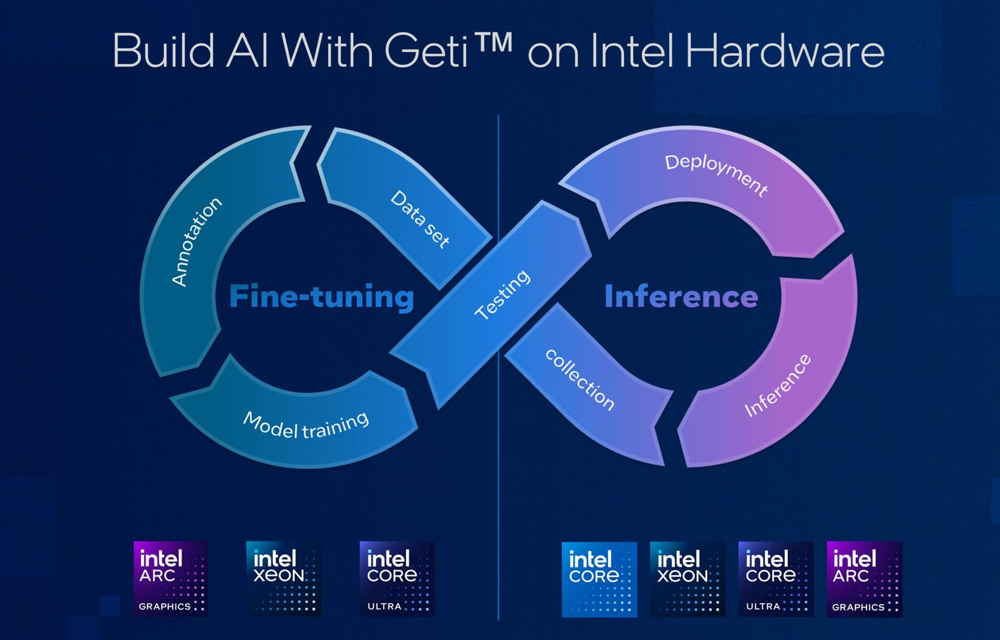

<!-- markdownlint-disable MD013 MD033 MD041 MD042 -->

 

## Introduction

Developing AI models from scratch is often slow, complex, and resource-intensive. Managing datasets, training pipelines,
optimization, and deployment typically requires stitching together multiple tools and workflows.

Geti™ offers a unified, end-to-end solution for building computer vision models, optimized for Intel® hardware but
flexible enough to run on a variety of platforms. With Geti, you can easily manage your datasets, fine-tune and quantize
models, and deploy them for inference — all within a single framework.

As a product, Geti™ consists of two components:

- **Geti™ Application** [[source]](application): A full-stack web application with an intuitive interface that covers the complete AI model
  lifecycle, from dataset preparation to model training to deployment and inference at the edge.
  This is ideal for users who want a turnkey solution to build and deploy models without needing to write code
  or manage complex pipelines.
- **Geti™ Library** (`getitune`) [[source]](library): A Python library that provides the building blocks for model fine-tuning and optimization, as well
  as several SOTA model architectures with their training pipelines.
  This is ideal for developers who want to integrate Geti's capabilities into their own applications or extend it with
  custom functionality.

 

> [!IMPORTANT]
> Information for `otx` users: this repo (`open-edge-platform/training_extensions`) previously hosted the OpenVINO
> Training Extensions project, namely `otx`; the development of that library now continues under the new name
> `getitune` in the `library` folder, as part of the broader Geti™ framework. The package will be published on PyPI
> as [`getitune`](https://pypi.org/project/getitune/), while the old package `otx` will be deprecated but still
> available for download.

## Key Features

- **Hardware Acceleration**: Geti™ is optimized for modern Intel® hardware with AI capabilities, such as Intel® Arc™
  GPUs and Intel® Core™ Ultra processors. Every trained model is automatically exported with
  [OpenVINO™](https://www.intel.com/content/www/us/en/developer/tools/openvino-toolkit/overview.html) and it can be
  deployed for inference across the full Intel® XPU portfolio.
- **Iterative Model Improvement**: Geti™ enables users to start building computer vision models with as few as 10-20
  images and iterate on those models in a rapid, feedback-driven loop. This allows you to quickly see results and make
  improvements without needing a large initial dataset; you can add more data as you go, and the predictions from the
  current model can help you annotate new data faster.
- **Multiple Computer Vision Tasks**: the Geti™ application supports image classification, object detection and instance
  segmentation, while the Geti™ library unlocks even more use cases by also including hierarchical classification,
  rotated object detection, semantic segmentation and keypoint detection.
- **Smart Annotations**: Geti™ includes powerful annotation tools that support both manual and semi-automated labeling
  by means of state-of-the-art AI models like SAM (Segment Anything Model). This significantly reduces the time and
  effort required to create high-quality training datasets.
- **Dataset Import & Export**: Geti™ supports importing and exporting datasets in common formats like COCO, Pascal VOC,
  and YOLO, making it easy to integrate with other tools and workflows.
- **Model Optimization**: Geti™ provides built-in support for quantization and optimization techniques that can reduce
  model size and improve inference speed, making it easier to deploy models on resource-constrained edge devices.
- **Inference Stream (NEW)**: Geti™ application includes a built-in inference pipeline that allows you to enable your
  trained models for real-time inference on video streams, with support for various input sources (cameras, video files,
  RTSP stream, ...). The predictions are visualized directly in the web application, and you can also configure it
  to forward the results to different destinations (folder, MQTT, webhook, ...) for easy integration with other systems.

## Supported tasks and models

Below is a list of tasks and templates supported by the Geti™ library and/or application.
Would you like to see a specific model added to the list? Let us know by opening a [GitHub issue](https://github.com/open-edge-platform/training_extensions/issues)!

### Image Classification

| Library: ✅ | Application: ✅ |
| ----------- | --------------- |

Show models

| Model Architecture    | Paper                                              |
| --------------------- | -------------------------------------------------- |
| ViT Tiny              | [ViT](https://arxiv.org/abs/2010.11929)            |
| DINOv2 Small          | [DINOv2](https://arxiv.org/abs/2304.07193)         |
| EfficientNet B0 / B3  | [EfficientNet](https://arxiv.org/abs/1905.11946)   |
| EfficientNet V2 Small | [EfficientNetV2](https://arxiv.org/abs/2104.00298) |
| MobileNet V3 Large    | [MobileNetV3](https://arxiv.org/abs/1905.02244)    |

> [!NOTE]
> Both library and application support **multi-class** and **multi-label** classification.
> In addition, the library offers **hierarchical** classification too.\_

### Object Detection

| Library: ✅ | Application: ✅ |
| ----------- | --------------- |

Show models

| Model Architecture     | Paper                                                                                                                                 |
| ---------------------- | ------------------------------------------------------------------------------------------------------------------------------------- |
| D-FINE M / L / X       | [DEIM](https://arxiv.org/abs/2412.04234) + [D-FINE](https://arxiv.org/abs/2410.13842)                                                 |
| DINOv3 DETR S / M / L  | [DINOv3](https://arxiv.org/abs/2508.10104) + [DEIMv2](https://arxiv.org/html/2509.20787v4) + [DETR](https://arxiv.org/abs/2005.12872) |
| MobileNet V2 ATSS      | [MobileNetV2](https://arxiv.org/abs/1801.04381) + [ATSS](https://arxiv.org/abs/1912.02424)                                            |
| MobileNet V2 SSD       | [MobileNetV2](https://arxiv.org/abs/1801.04381) + [SSD](https://arxiv.org/abs/1512.02325)                                             |
| RF-DETR S / M / L      | [RF-DETR](https://arxiv.org/abs/2511.09554)                                                                                           |
| RT-DETR R50            | [RT-DETR](https://arxiv.org/abs/2304.08069)                                                                                           |
| YOLOX Tiny / S / L / X | [YOLOX](https://arxiv.org/abs/2107.08430)                                                                                             |

### Instance Segmentation

| Library: ✅ | Application: ✅ |
| ----------- | --------------- |

Show models

| Model Architecture        | Paper                                                                                                 |
| ------------------------- | ----------------------------------------------------------------------------------------------------- |
| RTMDet Tiny               | [RTMDet](https://arxiv.org/abs/2212.07784)                                                            |
| Mask-RCNN EfficientNet B2 | [EfficientNet](https://arxiv.org/abs/1905.11946) + [Mask R-CNN](https://arxiv.org/abs/1703.06870)     |
| Mask-RCNN ResNet50        | [ResNet](https://arxiv.org/abs/1512.03385) + [Mask R-CNN](https://arxiv.org/abs/1703.06870)           |
| Mask-RCNN Swin-T          | [Swin Transformer](https://arxiv.org/abs/2103.14030) + [Mask R-CNN](https://arxiv.org/abs/1703.06870) |
| RF-DETR S / M / L         | [RF-DETR](https://arxiv.org/abs/2511.09554)                                                           |

### Semantic Segmentation

| Library: ✅ | Application: ✖️ |
| ----------- | --------------- |

Show models

| Model Architecture          | Paper                                          |
| --------------------------- | ---------------------------------------------- |
| DINOv2 Small                | [DINOv2](https://arxiv.org/abs/2304.07193)     |
| Lite-HRNet 18 / S / X       | [Lite-HRNet](https://arxiv.org/abs/2104.06403) |
| SegNeXt Tiny / Small / Base | [SegNeXt](https://arxiv.org/abs/2209.08575)    |

### Rotated Detection

| Library: ✅ | Application: ✖️ |
| ----------- | --------------- |

Show models

| Model Architecture        | Paper                                                                                             |
| ------------------------- | ------------------------------------------------------------------------------------------------- |
| Mask-RCNN EfficientNet B2 | [EfficientNet](https://arxiv.org/abs/1905.11946) + [Mask R-CNN](https://arxiv.org/abs/1703.06870) |
| Mask-RCNN ResNet50        | [ResNet](https://arxiv.org/abs/1512.03385) + [Mask R-CNN](https://arxiv.org/abs/1703.06870)       |

### Keypoint Detection

| Library: ✅ | Application: ✖️ |
| ----------- | --------------- |

Show models

| Model Architecture | Paper                                       |
| ------------------ | ------------------------------------------- |
| RTMPose Tiny       | [RTMPose](https://arxiv.org/abs/2212.07784) |

## Documentation

| Component       | README                                         | Documentation |
| --------------- | ---------------------------------------------- | ------------- |
| **Library**     | [library/README.md](library/README.md)         | Coming soon!  |
| **Application** | [application/README.md](application/README.md) | Coming soon!  |

## Community

- To report a bug or submit a feature request, please open a [GitHub issue](https://github.com/open-edge-platform/training_extensions/issues).
- Ask questions via [GitHub Discussions](https://github.com/open-edge-platform/training_extensions/discussions).

For those who would like to contribute to the library, see [CONTRIBUTING.md](CONTRIBUTING.md) for details.

Thank you! we appreciate your support!

