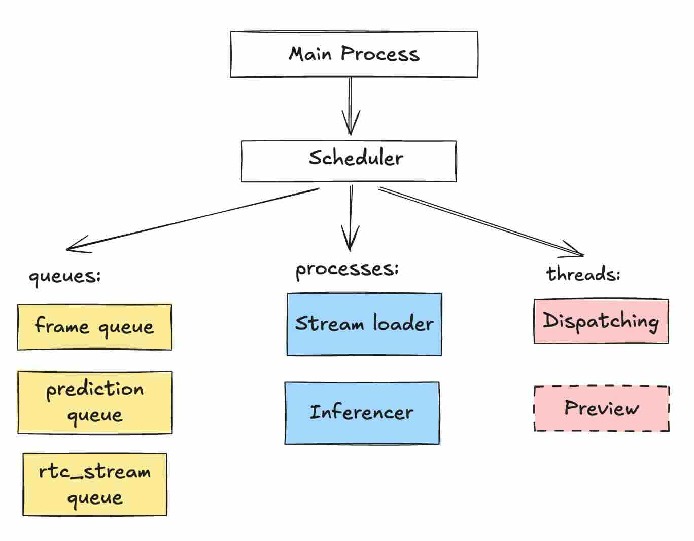
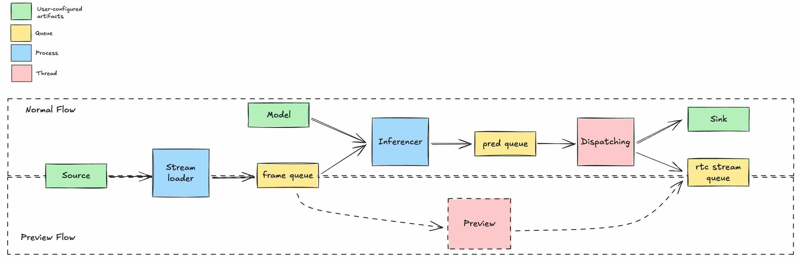

# ADR-0004: Source Preview Feature

- Status: `Proposed`
- Deciders: @itallix @leoll2
- Date: 2025-08-28

Technical Story: #4595

## Context and Problem Statement

Users need to preview the source of a pipeline (e.g., video file, camera stream) without running the entire pipeline.
This allows validation that the source is correctly configured and accessible before enabling processing and inference
through the full pipeline.

## Decision Drivers

- Preview feature should be designed around existing concept of pipelines.
- Only one pipeline can be active at any time (either preview or full).
- The preview pipeline outputs to a dedicated WebRTC stream.

## Considered Options

1. **Preview thread:**

   Reuse existing pipeline infrastructure. Introduces a thread that links the frame queue to the WebRTC preview stream.

   - Good:

     - Uses established IPC components (queues and event).
     - Minimal additional code outside thread management (relaxed validation for pipeline).
     - No changes to existing worker routines or API.

   - Bad:

     - Idle thread consumes some resources when preview is not active due to preemptive multitasking.
     - More threads mean slightly increased debugging and maintenance complexity.

2. **Dummy configs:**

   Run pipeline with "dummy" sink/model configuration, so inference and dispatch routines are started but don't perform work.

   - Good:

     - No new threading/IPC.
     - Relies on full pipeline logic for preview state transitions.

   - Bad:

     - Introduces more complexity: workers logic should be extended, new configuration types.
     - New orchestration phases should consider dummy types.
     - Unintended data flow (it will still write to the queues that are not needed for preview).

3. **Preview source only:**

   Create a separate preview abstraction around the source component, bypassing pipeline logic.

   - Good:

     - Better fits conceptually as it's totally separated from pipeline logic.

   - Bad:

     - Introduces more complexity: requires DB schema update, new APIs, new lifecycle management.
     - Does not meat decision drivers.

## Decision Outcome

**Chosen option:** Preview thread

- Meets all decision drivers.
- Requires minimal changes and keeps pipeline abstraction intact.
- Outputs to existing WebRTC stream.
- No effects on the main pipeline workers or APIs.

### Positive Consequences

- No changes to core workers routines.
- No additional IPC primitives required: queues and events reused.
- Pipeline abstraction remains consistent.
- No new API endpoints needed; existing logic covers preview functionality.

### Negative Consequences

- Idle preview thread may use some CPU/memory when no preview is active.
- Multithreading complexity increases.

### Implementation Details

The Scheduler is responsible for creating and cleaning up processes, threads, IPC resources, and related components.
The Scheduler should create a new thread called "Preview":

**Preview Thread Behavior:**

The Preview thread runs only when the pipeline is in preview mode.
It reads frames from the source frame queue and pushes them to the existing WebRTC queue.

**Preview Mode Conditions:**

- The pipeline has a source configured.
- The pipeline does not have a model configured.
- The pipeline does not have a sink configured.
- The pipeline is in the running state.

**Note:**
The Preview thread operates only alongside the "Stream loader" process, as other workers are inactive in preview mode.

### Open Questions?

- Is there any benefit to having a separate WebRTC queue for preview mode, or should we reuse the existing queue?
- Should the Preview thread be created on demand when the pipeline enters preview mode, rather than always running after
  being created by the Scheduler during server startup?
- Would it make sense to add an explicit boolean parameter, such as `preview`, to the Pipeline, so that preview mode is
  controlled directly rather than inferred implicitly from the pipeline configuration?

## Links <!-- optional -->

- [MADR project template](https://github.com/joelparkerhenderson/architecture-decision-record/tree/main/locales/en/templates/decision-record-template-of-the-madr-project)
- Implementation: see [Scheduler](../../../backend/app/core/scheduler.py), [Pipeline](../../../backend/app/schemas/pipeline.py)
