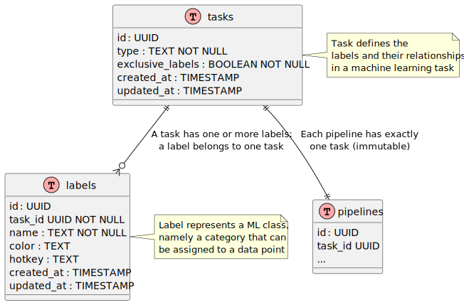

# Task and labels

A _task_ represents an instance of a machine learning problem (classification, detection, etc.) with a specific
set of _labels_, i.e. the classes or categories that can be assigned to objects in a dataset.
For example, a task to classify images of animals could have labels such as "cat", "dog", and "bird".
Depending on the task definition, labels can be mutually exclusive or not. For example, in a task of classifying
photos of landscapes, one image could have the labels "mountain" and "lake" without any contradiction. Conversely,
when classifying vehicles by type, an object can be a "car" or a "motorcycle", but not both at the same time.

Geti Tune supports the following task types:

- **Classification**: Categorize images into one (_multiclass_) or more (_multilabel_) classes.
- **Detection**: Identify and localize objects in images using bounding boxes.
- **Instance Segmentation**: Identify and segment objects in images using polygons.

[By design](#design-choices), every fully-configured pipeline is permanently associated with a task. 
While the task type cannot change, it is possible to modify the label structure of the task by adding,
removing or editing labels.

Both labels and tasks are uniquely identified by a UUID, which is immutable.
Labels also have a name and other frontend-related attributes (color, hotkey, etc.) that can be modified by the user.

## Storage

### DB schema



In the database, the information is stored in two tables: `tasks` and `labels`:

- `tasks` contains the metadata of the task, including its id, task type,
and whether the labels are mutually exclusive.
- `labels` contains the individual labels, each associated with a task. Each label has its own id, name
and other attributes for UX purposes (color, hotkey, etc.).

#### Example

Here is an example of how the database tables could look like for a task that classifies chess pieces by type.
The field `exclusive_labels` is set to `true` because each piece is strictly one of the six types, you can't have
an item that is both a "Pawn" and a "Knight".

_'tasks' table_

| id                                   | task_type      | exclusive_labels |
|--------------------------------------|----------------|------------------|
| 550e8400-e29b-41d4-a716-446655440000 | classification | true             |

_'labels' table_

| id                                   | task_id                              | name    | color    | hotkey |
|--------------------------------------|--------------------------------------|---------|----------|--------|
| 550e8400-e29b-41d4-a716-446655440002 | 550e8400-e29b-41d4-a716-446655440000 | Pawn    | #A0A0A0  | p      |
| 550e8400-e29b-41d4-a716-446655440003 | 550e8400-e29b-41d4-a716-446655440000 | Knight  | #8090C0  | n      |
| 550e8400-e29b-41d4-a716-446655440004 | 550e8400-e29b-41d4-a716-446655440000 | Bishop  | #A070C0  | b      |
| 550e8400-e29b-41d4-a716-446655440005 | 550e8400-e29b-41d4-a716-446655440000 | Rook    | #C07070  | r      |
| 550e8400-e29b-41d4-a716-446655440006 | 550e8400-e29b-41d4-a716-446655440000 | Queen   | #D090D0  | q      |
| 550e8400-e29b-41d4-a716-446655440007 | 550e8400-e29b-41d4-a716-446655440000 | King    | #E0C070  | k      |

## REST API

The following endpoints play a role in the task and labels management:

| Method  | Path                         | Payload                   | Return        | Description                           |
|---------|------------------------------|---------------------------|---------------|---------------------------------------|
| `POST`  | `/api/pipelines`             | source, sink, model, task | pipeline info | Create and configure a new pipeline   |
| `POST`  | `/api/pipelines/<id>/task`   | task                      | task          | Set the task and labels of a pipeline |
| `GET`   | `/api/pipelines/<id>/task`   | -                         | task          | Get the task and labels of a pipeline |
| `PATCH` | `/api/pipelines/<id>/task`   | labels to change          | task          | Add, remove or edit labels            |

The pipeline creation endpoint (`POST /api/pipelines`) allows to optionally provide the definition of the task
(labels included), which is useful to fully setup a pipeline that can be immediately activated. In other cases,
the information about the task can be omitted in the pipeline creation payload, and the task can be set later using the
`POST /api/pipelines/<id>/task` endpoint. Note that the latter can be called only once per pipeline, as the task
is immutable once set. The `GET /api/pipelines/<id>/task` endpoint allows to retrieve the task and labels associated
with a pipeline, while the `PATCH /api/pipelines/<id>/task` endpoint allows to modify the labels of a task
by adding, removing or editing them.

This is an example of how the task information could be represented in the payload of the two `POST` endpoints:

```json
{
  "type": "classification",
  "exclusive_labels": true,
  "labels": [
    { "name": "Pawn", "color": "#A0A0A0", "hotkey": "p" },
    { "name": "Knight", "color": "#8090C0", "hotkey": "n" },
    { "name": "Bishop", "color": "#A070C0", "hotkey": "b" },
    { "name": "Rook", "color": "#C07070", "hotkey": "r" },
    { "name": "Queen", "color": "#D090D0", "hotkey": "q" },
    { "name": "King", "color": "#E0C070", "hotkey": "k" }
  ]
}
```

while the response would look like this:

```json
{
  "id": "550e8400-e29b-41d4-a716-446655440000",
  "type": "classification",
  "exclusive_labels": true,
  "labels": [
    { "id": "550e8400-e29b-41d4-a716-446655440002", "name": "Pawn", "color": "#A0A0A0", "hotkey": "p" },
    { "id": "550e8400-e29b-41d4-a716-446655440003", "name": "Knight", "color": "#8090C0", "hotkey": "n" },
    { "id": "550e8400-e29b-41d4-a716-446655440004", "name": "Bishop", "color": "#A070C0", "hotkey": "b" },
    { "id": "550e8400-e29b-41d4-a716-446655440005", "name": "Rook", "color": "#C07070", "hotkey": "r" },
    { "id": "550e8400-e29b-41d4-a716-446655440006", "name": "Queen", "color": "#D090D0", "hotkey": "q" },
    { "id": "550e8400-e29b-41d4-a716-446655440007", "name": "King", "color": "#E0C070", "hotkey": "k" }
  ]
}
```

The `PATCH` endpoint can provide information about the labels to add, remove or edit. For example:

```json
{
  "labels_to_edit": [{"id": "550e8400-e29b-41d4-a716-446655440003", "new_name": "horse", "new_color": "#8090C1", "new_hotkey": "h"}],
  "labels_to_add": [{"name": "Archbishop", "color": "#A070C1", "hotkey": "a"}],
  "labels_to_remove": [{"id": "550e8400-e29b-41d4-a716-446655440004"}]
}

```

## Design choices

This section provides a breakdown of some of the design choices made in the task and labels management system.

### Supported task types

The first iteration of Geti Tune only support three of the most common task types: classification, detection and
segmentation. This simplification comes from Geti's experience, where the proliferation of task types, each with its
own quirks, has led to a complex and hard-to-maintain codebase. Geti Tune is open to extending the supported task types
in the future, but only after careful estimation of the value in relation to the complexity. Note that other products
in the Geti ecosystem, such as Geti Inspect, offer additional tasks like anomaly detection.

### Task - labels association

A task defines one or more labels - the minimum number actually depends on the task type.
Labels belong to exactly one task: they can't be reparented to a different task but they can be modified or deleted.
The reason why labels can't exist independently of a task is that the type of task imposes many constraints of the
labels themselves. For example, an empty label cannot exist in a multiclass classification task, while it can in
detection or multilabel classification. Other examples could be task types like anomaly detection, hierarchical
classification, keypoint detection, ..., which all have a peculiar label structure; while these tasks are not yet
supported, the design aims to be extensible enough to accommodate them in the future.

### Pipeline - task association

The link between a pipeline and its task is immutable, which means that once the pipeline is configured for a specific
task, it cannot be changed to a different one. This constraint is in place to ensure that the pipeline, when active,
always outputs data with a consistent type (e.g. bounding boxes or polygons, but not a mix of both), thus allowing for
stronger assumptions about datasets and model compatibility.

Note that a pipeline may be created without a task, but it cannot be activated until a task is assigned to it
and all the other components (source, sink, model, ...) are configured appropriately.

In the future, it may be possible to share the same task across multiple pipelines, enabling interesting use cases
such as two (nearly) identical pipelines that run in parallel with the same model on different input devices. Such
feature is out-of-scope for now, but it is facilitated by decoupling the task entity from the pipeline while
establishing a relationship (1:1, potentially 1:N) between them.