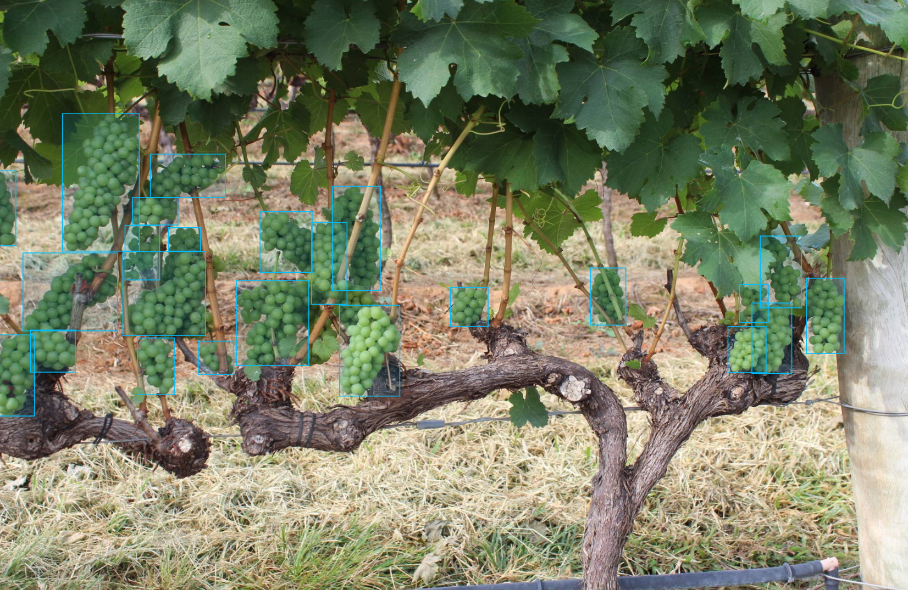

Object Detection model
======================

This tutorial provides a step-by-step guide — from installation to model training — for the object detection task using a specific example.

To learn more about the object detection task, refer to :doc:`../../../explanation/algorithms/object_detection/object_detection`.

In this tutorial, we demonstrate how to train and validate the **ATSS** model on the publicly available **WGISD** dataset.
For details on how to export, optimize, and deploy the trained model, refer to :doc:`../export`.

To provide a concrete example, all commands in this tutorial use the **ATSS** model — a medium-sized architecture that offers a good trade-off between accuracy and inference speed.

This process has been tested with the following configuration:

- Ubuntu 20.04
- NVIDIA GeForce RTX 3090
- Intel(R) Core(TM) i9-11900
- CUDA Toolkit 11.8

*************************
Setup virtual environment
*************************

1. You can follow the installation process from a :doc:`quick start guide <../../../get_started/installation>`
to create a universal virtual environment for Geti Library.

2. Activate your virtual environment:

.. code-block:: shell

    source .venv/bin/activate

.. _wgisd_dataset_descpiption:

***************************
Dataset preparation
***************************

..  note::

    Currently, we support the following object detection dataset formats:

    - `COCO <https://cocodataset.org/#format-data>`_
    - `Pascal-VOC <https://openvinotoolkit.github.io/datumaro/stable/docs/data-formats/formats/pascal_voc.html>`_
    - `YOLO <https://openvinotoolkit.github.io/datumaro/stable/docs/data-formats/formats/yolo.html>`_

1. Clone a repository with
`WGISD dataset <https://github.com/thsant/wgisd>`_.

.. code-block:: shell

    mkdir data ; cd data
    git clone https://github.com/thsant/wgisd.git
    cd wgisd
    git checkout 6910edc5ae3aae8c20062941b1641821f0c30127

This dataset contains images of grapevines with the annotation for different varieties of grapes.

- ``CDY`` - Chardonnay
- ``CFR`` - Cabernet Franc
- ``CSV`` - Cabernet Sauvignon
- ``SVB`` - Sauvignon Blanc
- ``SYH`` - Syrah

It's a great example to start with. The model achieves high accuracy right from the beginning of the training due to relatively large and focused objects. Also, these objects are distinguished by a person, so we can check inference results just by looking at images.

|

|

2. To run the training using :doc:`auto-configuration feature <../../../explanation/additional_features/auto_configuration>`,
we need to reformat the dataset according to this structure:

.. code-block:: shell

    wgisd
    ├── annotations/
        ├── instances_train.json
        ├── instances_val.json
        └── instances_test.json
    ├──images/
        ├── train
        ├── val
        └── test

We can do that by running these commands:

.. code-block:: shell

    # format images folder
    mv data images

    # format annotations folder
    mv coco_annotations annotations

    # rename annotations to meet *_train.json pattern
    mv annotations/train_bbox_instances.json annotations/instances_train.json
    mv annotations/test_bbox_instances.json annotations/instances_val.json
    cp annotations/instances_val.json annotations/instances_test.json

    cd ../..

*********
Training
*********

1. First of all, you need to choose which object detection model you want to train.
The list of supported recipes for object detection is available with the command line below.

.. note::

    The characteristics and detailed comparison of the models could be found in :doc:`Explanation section <../../../explanation/algorithms/object_detection/object_detection>`.

.. tab-set::

    .. tab-item:: CLI

        .. code-block:: shell

            (getitune) ...$ getitune find --task DETECTION --pattern atss
            ┏━━━━━━━━━━━┳━━━━━━━━━━━━━━━━━━━━━━━┳━━━━━━━━━━━━━━━━━━━━━━━━━━━━━━━━━━━━━━━━━━━━━━━━━━━━━━━━━━━━━━━━┓
            ┃ Task      ┃ Model Name            ┃ Recipe Path                                                    ┃
            ┡━━━━━━━━━━━╇━━━━━━━━━━━━━━━━━━━━━━━╇━━━━━━━━━━━━━━━━━━━━━━━━━━━━━━━━━━━━━━━━━━━━━━━━━━━━━━━━━━━━━━━━┩
            │ DETECTION │ atss_mobilenetv2_tile │ src/getitune/recipe/detection/atss_mobilenetv2_tile.yaml            │
            │ DETECTION │ atss_resnext101       │ src/getitune/recipe/detection/atss_resnext101.yaml                  │
            │ DETECTION │ atss_resnext101_tile  │ src/getitune/recipe/detection/atss_resnext101_tile.yaml             │
            │ DETECTION │ atss_mobilenetv2      │ src/getitune/recipe/detection/atss_mobilenetv2.yaml                 │
            └───────────┴───────────────────────┴────────────────────────────────────────────────────────────────┘

    .. tab-item:: API

        .. code-block:: python

            from getitune.backend.lightning.cli.utils import list_models

            model_lists = list_models(task="DETECTION", pattern="atss")
            print(model_lists)
            '''
            [
                'atss_mobilenetv2',
                'atss_mobilenetv2_tile',
                'atss_resnext101',
                'atss_resnext101_tile',
            ]
            '''

.. _detection_workspace:

2. On this step we will configure configuration
with:

- all necessary configs for atss_mobilenetv2
- train/validation sets, based on provided annotation.

It may be counterintuitive, but for ``--data_root`` we need to pass the path to the dataset folder root (in our case it's ``data/wgisd``) instead of the folder with validation images.
This is because the function automatically detects annotations and images according to the expected folder structure we achieved above.

Let's check the object detection configuration running the following command:

.. code-block:: shell

    # or its config path
    (getitune) ...$ getitune train --config  src/getitune/recipe/detection/atss_mobilenetv2.yaml \
                         --data_root data/wgisd \
                         --work_dir getitune-workspace \
                         --print_config

    ...
    data_root: data/wgisd
    work_dir: getitune-workspace
    callback_monitor: val/map_50
    disable_infer_num_classes: false
    engine:
      task: DETECTION
      device: auto
    data:
    ...

.. note::

    If you want to get configuration as yaml file, please use ``--print_config`` parameter and ``> configs.yaml``.

    .. code-block:: shell

        (getitune) ...$ getitune train --config  src/getitune/recipe/detection/atss_mobilenetv2.yaml --data_root data/wgisd --print_config > configs.yaml
        # Update configs.yaml & Train configs.yaml
        (getitune) ...$ getitune train --config configs.yaml

3. ``getitune train`` trains a model (a particular model recipe)
on a dataset and results:

Here are the main outputs can expect with CLI:
- ``{work_dir}/{timestamp}/checkpoints/epoch_*.ckpt`` - a model checkpoint file.
- ``{work_dir}/{timestamp}/configs.yaml`` - The configuration file used in the training can be reused to reproduce the training.
- ``{work_dir}/.latest`` - The results of each of the most recently executed subcommands are soft-linked. This allows you to skip checkpoints and config file entry as a workspace.

.. tab-set::

    .. tab-item:: CLI (auto-config)

        .. code-block:: shell

            (getitune) ...$ getitune train --data_root data/wgisd

    .. tab-item:: CLI (with config)

        .. code-block:: shell

            (getitune) ...$ getitune train --config src/getitune/recipe/detection/atss_mobilenetv2.yaml --data_root data/wgisd

    .. tab-item:: API (from_config)

        .. code-block:: python

            from getitune.backend.lightning.engine import LightningEngine

            data_root = "data/wgisd"
            recipe = "src/getitune/recipe/detection/atss_mobilenetv2.yaml"

            engine = LightningEngine.from_config(
                      config_path=recipe,
                      data_root=data_root,
                      work_dir="getitune-workspace",
                    )

            # it is also possible to pass a config as a model to the Engine directly
            engine = LightningEngine(
                      model=recipe,
                      data=data_root,
                      work_dir="getitune-workspace",
                    )

            # one more possibility to obtain the right engine by the given model/dataset
            from getitune.engine import create_engine
            engine = create_engine(
                      model=recipe,
                      data=data_root,
                      work_dir="getitune-workspace",
                    )

            engine.train(...)

    .. tab-item:: API

        .. code-block:: python

            from getitune.backend.lightning.engine import LightningEngine
            from getitune.backend.lightning.models.detection.atss import ATSS

            data_root = "data/wgisd"
            model = ATSS(
                        model_name="atss_mobilenetv2",
                        label_info = {"label_names": ["Chardonnay", "Cabernet Franc", "Cabernet Sauvignon", "Sauvignon Blanc", "Syrah"],
                                     "label_id": [0, 1, 2, 3, 4],
                                     "label_groups": [["Chardonnay", "Cabernet Franc", "Cabernet Sauvignon", "Sauvignon Blanc", "Syrah"]]},
                        data_input_params = {"input_size": [800, 992],
                                            "mean": [0.0, 0.0, 0.0],
                                            "std": [255.0, 255.0, 255.0]}
                    )

            engine = LightningEngine(
                      model=model,
                      data=data_root,
                      work_dir="getitune-workspace",
                    )

            # one more possibility to obtain the right engine by the given model/dataset
            # using "create_engine" function
            from getitune.engine import create_engine
            engine = create_engine(
                      model=model,
                      data=data_root,
                    )

            engine.train(...)

4. ``(Optional)`` Additionally, we can tune training parameters such as batch size, learning rate, patience epochs or warm-up iterations.
Learn more about specific parameters using ``getitune train --help -v`` or ``getitune train --help -vv``.

For example, to decrease the batch size to 4, fix the number of epochs to 100, extend the command line above with the following line.

.. tab-set::

    .. tab-item:: CLI

        .. code-block:: shell

            (getitune) ...$ getitune train ... --data.train_subset.batch_size 4 \
                                     --max_epochs 100

    .. tab-item:: API

        .. code-block:: python

            from getitune.config.data import SubsetConfig
            from getitune.data.module import DataModule
            from getitune.backend.lightning.engine import LightningEngine

            datamodule = DataModule(..., train_subset=SubsetConfig(..., batch_size=4))

            engine = LightningEngine(..., data=datamodule)

            engine.train(max_epochs=100)

5. The training result ``checkpoints/*.ckpt`` file is located in ``{work_dir}`` folder,
while training logs can be found in the ``{work_dir}/{timestamp}`` dir.

.. note::
    We also can visualize the training using ``Tensorboard`` as these logs are located in ``{work_dir}/{timestamp}/tensorboard``.

.. code-block::

    getitune-workspace
    ├── 20240403_134256/
        ├── csv/
        ├── checkpoints/
        |   └── epoch_*.pth
        ├── tensorboard/
        └── configs.yaml
    └── .latest
        └── train/
    ...

The training time highly relies on the hardware characteristics, for example on 1 NVIDIA GeForce RTX 3090 the training took about 3 minutes.

After that, we have the PyTorch object detection model trained with Geti Library, which we can use for evaluation, export, optimization and deployment.

6. It is also possible to resume training from the last checkpoint.
For this, we can use the ``--resume`` parameter with the path to the checkpoint file.

.. tab-set::

    .. tab-item:: CLI

        .. code-block:: shell

            (getitune) ...$ getitune train --config src/getitune/recipe/classification/multi_class_cls/mobilenet_v3_large.yaml \
                                  --data_root data/flower_photos \
                                  --checkpoint getitune-workspace/20240403_134256/checkpoints/epoch_014.ckpt \
                                  --resume True

    .. tab-item:: API

        .. code-block:: python

            engine.train(resume=True,
                         checkpoint="getitune-workspace/20240403_134256/checkpoints/epoch_014.ckpt")

***********
Evaluation
***********

1. ``getitune test`` runs evaluation of a
trained model on a particular dataset.

Test function receives test annotation information and model snapshot, trained in previous step.

The default metric is mAP_50 measure.

2. That's how we can evaluate the snapshot in ``getitune-workspace``
folder on WGISD dataset and save results to ``getitune-workspace``:

.. tab-set::

    .. tab-item:: CLI (with work_dir)

        .. code-block:: shell

            (getitune) ...$ getitune test --work_dir getitune-workspace
            ┏━━━━━━━━━━━━━━━━━━━━━━━━━━━┳━━━━━━━━━━━━━━━━━━━━━━━━━━━┓
            ┃        Test metric        ┃       DataLoader 0        ┃
            ┡━━━━━━━━━━━━━━━━━━━━━━━━━━━╇━━━━━━━━━━━━━━━━━━━━━━━━━━━┩
            │      test/data_time       │   0.025369757786393166    │
            │       test/map_50         │    0.8693901896476746     │
            │      test/iter_time       │    0.08180806040763855    │
            └───────────────────────────┴───────────────────────────┘

    .. tab-item:: CLI (with config)

        .. code-block:: shell

            (getitune) ...$ getitune test --config  src/getitune/recipe/detection/atss_mobilenetv2.yaml \
                                --data_root data/wgisd \
                                --checkpoint getitune-workspace/20240312_051135/checkpoints/epoch_033.ckpt
            ┏━━━━━━━━━━━━━━━━━━━━━━━━━━━┳━━━━━━━━━━━━━━━━━━━━━━━━━━━┓
            ┃        Test metric        ┃       DataLoader 0        ┃
            ┡━━━━━━━━━━━━━━━━━━━━━━━━━━━╇━━━━━━━━━━━━━━━━━━━━━━━━━━━┩
            │      test/data_time       │   0.025369757786393166    │
            │       test/map_50         │    0.8693901896476746     │
            │      test/iter_time       │    0.08180806040763855    │
            └───────────────────────────┴───────────────────────────┘

    .. tab-item:: API

        .. code-block:: python

            engine.test()

3. The output of ``{work_dir}/{timestamp}/csv/version_0/metrics.csv`` consists of
a dict with target metric name and its value.

The next tutorial on how to export, optimize, and deploy the model is available at :doc:`../export`.
